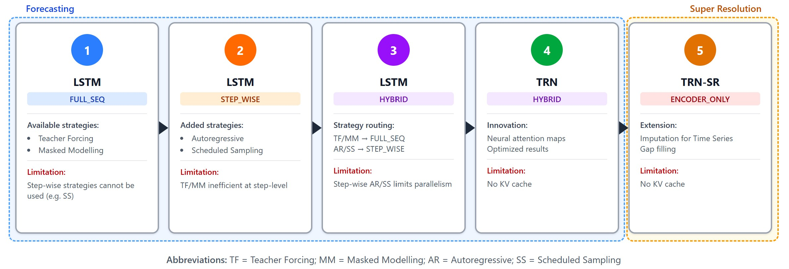
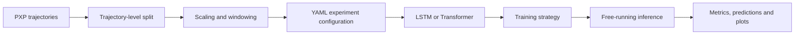
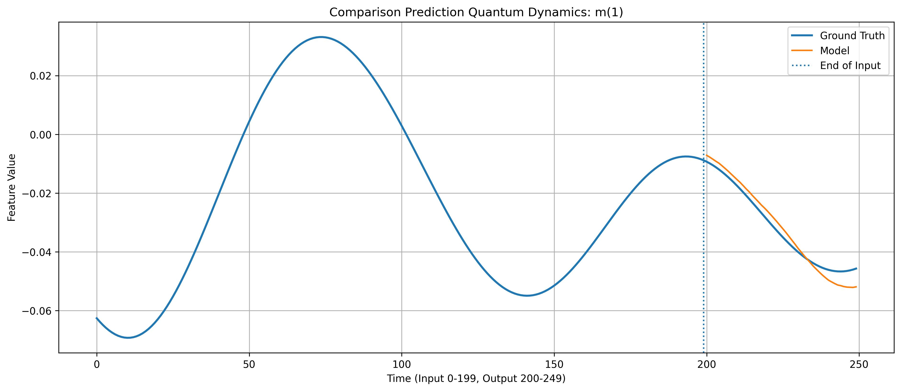
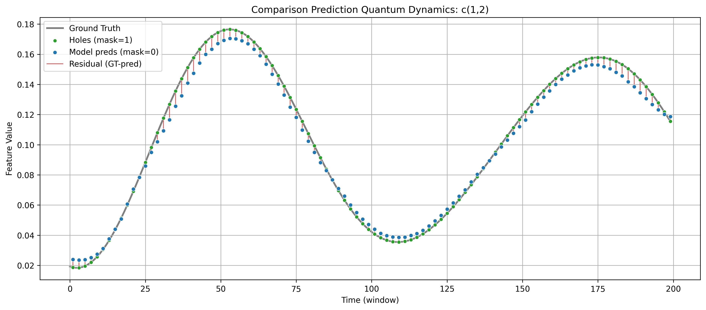
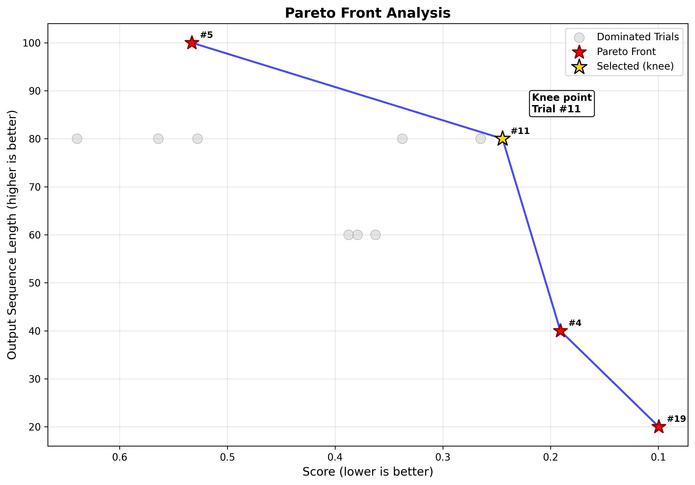
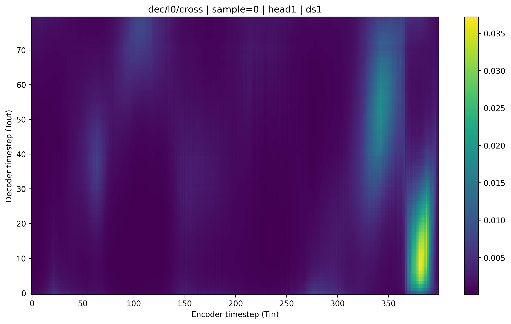

<div align="center">

# Qubit Evolution DL

**Deep-learning models for forecasting and reconstructing quantum dynamics**


</div>

> **Project status:** completed academic research prototype. The repository is
> preserved as the software artifact of a university project and is not under
> active product development.

## Overview

Qubit Evolution DL investigates whether sequence models can learn the temporal
dynamics of an interacting quantum system from simulated observables. The
project addresses two related tasks:

- **Forecasting:** infer future observables from an initial observation window.
- **Temporal super-resolution:** reconstruct missing time steps from sparse
  measurements.

The implementation provides a configuration-driven TensorFlow pipeline covering
data preparation, model training, free-running evaluation, hyperparameter
optimization, and scientific visualization.

## Research setting

The experiments use trajectories generated from the **PXP model**, a constrained
spin-chain model commonly used to study quantum many-body dynamics.

| Property | Value |
|---|---:|
| Qubits | 10 |
| Simulated trajectories | 400 |
| Time interval | 0–20 s |
| Sampling interval | 0.02 s |
| Samples per trajectory | 1,001 |
| Observables per time step | 10 magnetizations + 45 pairwise correlations |

## Model roadmap

The study progresses from recurrent baselines to attention-based forecasting
and reconstruction models.



| Model | Architecture | Primary task |
|---|---|---|
| LSTM Full-Seq | LSTM encoder–decoder | Forecasting |
| LSTM Step-Wise | Autoregressive LSTM | Forecasting |
| LSTM Hybrid | Hybrid recurrent encoder–decoder | Forecasting |
| Transformer Hybrid | Transformer encoder–decoder | Forecasting |
| Transformer SR | Encoder-only Transformer | Super-resolution |

## Experimental pipeline



Depending on the model, training combines teacher forcing, autoregressive
rollouts, masked modeling, scheduled sampling, and curriculum strategies.
Evaluation includes free-running probes designed to expose the gap between
assisted training and autonomous prediction.

## Representative results

### Forecasting

The hybrid Transformer generally follows the direction and broad shape of
short-horizon dynamics. Prediction error increases with the forecast horizon,
particularly for the more difficult correlation observables.



### Super-resolution

The encoder-only Transformer reconstructs missing samples while preserving the
main temporal trend. The largest residuals occur around rapid changes in the
signal.



These figures illustrate representative experiments rather than a claim of
production-grade physical simulation. Longer free-running forecasts remain
sensitive to accumulated error and exposure bias.

## Tuning and interpretability

Hyperparameter search is organized as a two-level Optuna workflow. The second
level treats prediction score and output horizon as competing objectives,
producing a Pareto front from which a balanced knee-point configuration can be
selected.

| Multi-objective search | Cross-attention inspection |
|---|---|
|  |  |

Attention maps complement numerical metrics by showing which input positions
the decoder uses while producing its forecast.

## Quick start

The most reproducible entry point is the Docker environment:

```bash
docker compose build
docker compose run --rm app bash
python scripts/download_data.py
python main.py --run-cfg trn_hybrid
```

For Conda installation, GPU notes, configuration options, all run commands,
tuning, plotting, and troubleshooting, see the dedicated
**[configuration and execution guide](CONFIGURATION.md)**.

## Repository structure

```text
qubit-evolution-dl/
├── configs/              # Experiment YAML files
├── data/                 # Local dataset location
├── docker/               # Container requirements
├── docs/                 # Guides, paper, slides and LaTeX sources
├── scripts/              # Data-download and visualization utilities
├── src/qubit/
│   ├── callbacks/        # Training callbacks
│   ├── core/             # Data pipeline and experiment core
│   ├── evaluation/       # Evaluation utilities
│   ├── inference/        # Model-specific inference adapters
│   ├── models/           # LSTM and Transformer architectures
│   ├── strategies/       # Training strategies
│   └── utils/            # Shared helpers
├── tuning/               # Optuna optimization workflow
├── main.py               # Main experiment entry point
└── environment.yml       # Conda environment definition
```

## Documentation

- [Configuration and execution](CONFIGURATION.md)
- [Complete configuration reference](docs/example.yaml)
- [Hyperparameter tuning](docs/tuning.md)
- [Plotting guide](docs/plotting.md)
- [Research report](docs/report.pdf)
- [Project presentation](docs/slideshow.pdf)
- [Report LaTeX source](docs/latex_source/report)
- [Presentation LaTeX source](docs/latex_source/slideshow)

## Academic context

The project was developed by **Giuseppe Rudi** and **Francesco Cristiano** in
the Artificial Intelligence and Computer Science programme at the University
of Calabria.

No software license is currently included. Unless a license is added, the
repository should be treated as an academic reference artifact rather than as
reusable open-source software.
